# Phiếu Điều Chuyển

## 1. Mô tả quy trình điều chuyển hàng 

.png)

## 2. Quy trình tạo **Phiếu điều chuyển**
### 2.1. **Tạo** Phiếu điều chuyển

- Chọn **Menu (☰)**

- Chọn **Kho hàng** → **Sản phẩm**

- Mở **Chi tiết** của **Phiếu điều chuyển**

- Chọn **Tạo mới**

- Ở Tab **Thông tin phiếu**, điền thông tin vào các ô

- Chọn Tab **Chọn sản phẩm**

- **Thêm sản phẩm** gồm 2 cách:

  - Cách 1: **Hàng loạt (Upload)** bằng Template Excel

    - Chọn sản phẩm → Hàng loạt (Upload) → Chọn Template để tải xuống → Chọn tệp vừa điền để tải lên → <strong>Lưu</strong> khi hoàn tất

.png)

<em>(*) Template mẫu</em>
.png)

    - Cách 2: Tab Chọn sản phẩm → Chọn sản phẩm → Tìm mã sản phẩm → Điền số lượng yêu cầu

<em>(*) Lưu ý: sau khi điền số lượng, cuộn chuột xuống cuối bảng để kiểm tra (không được ấn nút **Enter**)</em>

.png) 

- Kiểm tra sản phẩm đã chọn và **Lưu**

<em>(*) <strong>Tồn khả dụng</strong> là <strong>Tồn thực tế - Chờ xuất</strong></em>

- Kiểm tra thông tin phiếu và **Xác nhận**

- Sau khi người tạo Phiếu điều chuyển **Xác Nhận**, **Trưởng bộ phận** vào **Duyệt Phiếu**

- Sau khi Phiếu điều chuyển đã được duyệt -> Hệ thống tự tạo Phiếu xuất ở tình trạng **Nháp** (Mã phiếu màu xám)

### 2.2. **Sửa** hoặc **Xóa** Phiếu điều chuyển
- 
Có 2 trường hợp:

  - 
Trường hợp 1: Phiếu điều chuyển **Chưa duyệt**

  - 
Trường hợp 2: Phiếu điều chuyển **Đã duyệt**

#### 2.1.1. Phiếu điều chuyển **Chưa duyệt**
  - 
Chọn **Hủy phiếu**

   

#### 2.1.2. Phiếu điều chuyển **Đã duyệt**
- Bấm vào **Mã phiếu xuất** để mở **Phiếu xuất kho**  → Chọn **Hủy** 

(*) Phiếu xuất ở tình trạng <strong>Đã xuất kho</strong> *(Mã phiếu màu xanh)* thì không được hủy <strong>Phiếu xuất kho</strong> →
Không được hủy <strong>Phiếu điều chuyển</strong>

  - Chọn **Mở lại** nếu muốn tiếp tục/chỉnh sửa Phiếu
  - Chọn **Xóa phiếu** nếu không còn nhu cầu 

  

## 3. Quy trình **Xuất kho**

- Chọn **Kho hàng** → **Sản phẩm**
- Mở **Chi tiết** của **Xuất kho**

- Thêm **Trạng thái** và **Loại phiếu** trong ô tìm kiếm
- Chọn **Tìm kiếm**

- Kiểm tra **Nguồn** và **Mã phiếu**
- Chọn **Xem chi tiết**

- Kiểm tra **Tổng sản phẩm** và **Chi tiết xuất kho**
- Chọn **Bắt đầu đếm**

- Chọn **Xuất tất cả** nếu đáp ứng số lượng yêu cầu
- Trường hợp số lượng thực tế không đủ yêu cầu thì chỉnh sửa số lượng xuất
- Kiểm tra và **Xuất kho**

- Sau khi **Xuất kho** → hệ thống tự tạo **Phiếu nhập**
- **Đóng** khi hoàn tất

## 4. Quy trình **Nhập kho**

- Mở **Chi tiết** của **Nhập kho**

- Chọn **Trạng thái** và **Loại phiếu** trong ô tìm kiếm
- Chọn **Tìm Kiếm**

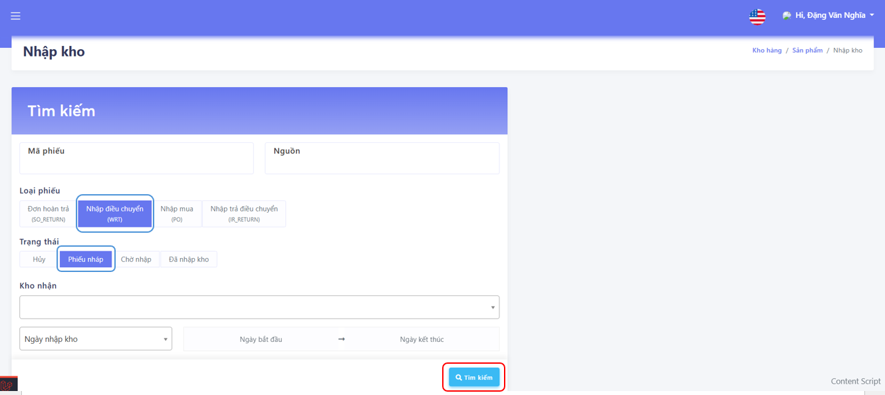

- (**) Mã phiếu là mã vừa hiện khi <strong>Xuất kho</strong>, Nguồn là <strong>Mã phiếu nhập</strong> và <strong>Mã phiếu điều chuyển</strong>
- Chọn **Xem chi tiết**

- Chọn **Bắt đầu đếm** sau khi kiểm tra thông tin

- 
Từ đây sẽ có 3 trường hợp giả định

  - 
<em>Trường hợp 1: Nhập <strong>đủ</strong> số lượng</em>

  - 
<em>Trường hợp 2: Nhập <strong>thiếu</strong> số lượng</em>

  - 
<em>Trường hợp 3: Nhập <strong>dư</strong> số lượng</em>

### Trường hợp 1: Nhập **đủ** số lượng

- Chọn **Xuất tất cả** để xuất theo yêu cầu
- Kiểm tra lại và chọn **Xuất kho**
- Chọn **Đóng** sau khi **Xuất kho**

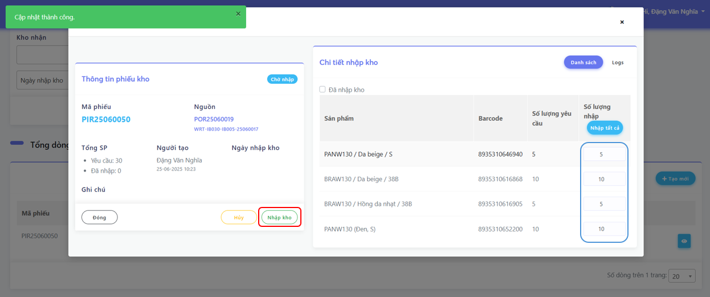

- Vào lại Module **Kho Hàng**
- Chọn **Sản Phẩm**
- Chọn **Chi Tiết** của **Phiếu điều chuyển**

- Kiểm tra **Mã phiếu điều chuyển**
- Chọn **Xem chi tiết**

- Kiểm tra số lượng nhập và số lượng xuất

(*) Ví dụ: POR25060019<strong>(30)</strong> = PIR25060050<strong>(30)</strong> (Số cuối trong ngoặc)

- Chọn **Hoàn thành** sau khi kiểm tra

### Trường hợp 2: Nhập **thiếu** số lượng

- Vào lại Module **Kho Hàng**
- Chọn **Sản Phẩm**
- Chọn **Chi Tiết** của **Nhập Kho**

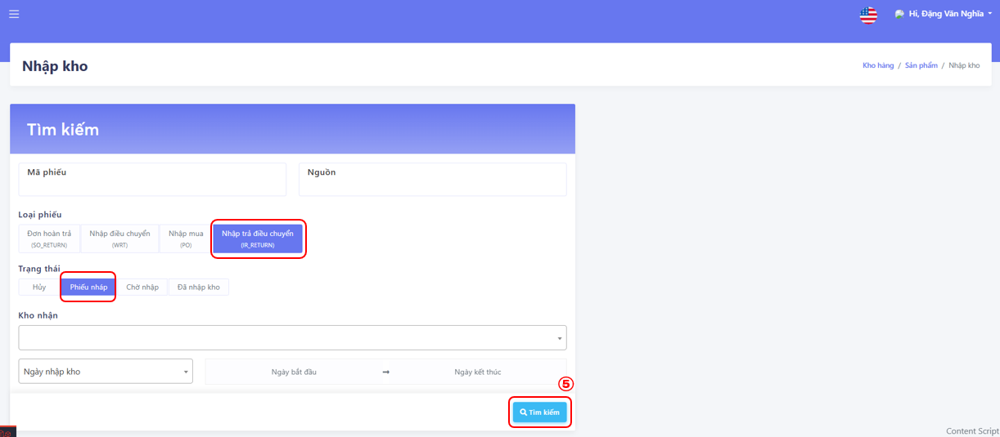

(*) Đơn hàng trả được hệ thống <strong>TỰ ĐỘNG TẠO</strong> sau khi<strong> Kho nhập</strong> nhập ít hơn so với yêu cầu

(*) IR_RETURN được ghi chú để xác định đơn trả  

- Chọn **Xem chi tiết**

- Chọn **Bắt đầu đếm**

(*) Không thể sửa <strong>Số lượng nhập</strong>
- Chọn **Nhập kho**

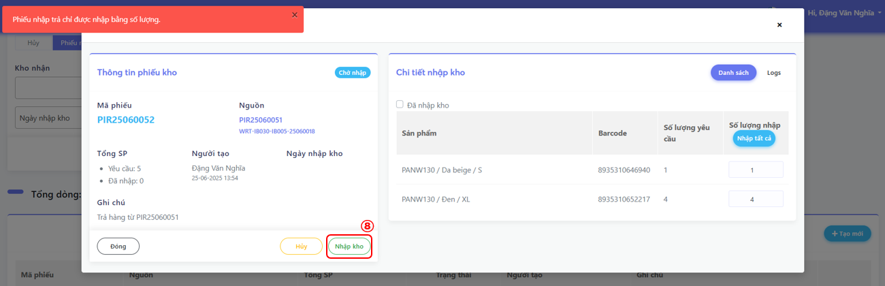

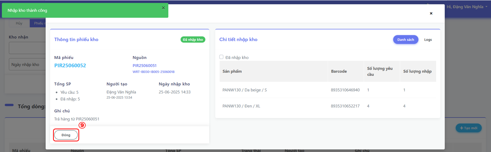

- Vào lại Module **Kho Hàng**
- Chọn **Sản Phẩm**
- Chọn **Chi Tiết** của **Phiếu điều chuyển**

- Chọn **Xem chi tiết**

- Kiểm tra số lượng **xuất, nhận, trả**
- Chọn **Hoàn thành** sau khi kiểm tra

### Trường hợp 3: Nhập **dư** số lượng

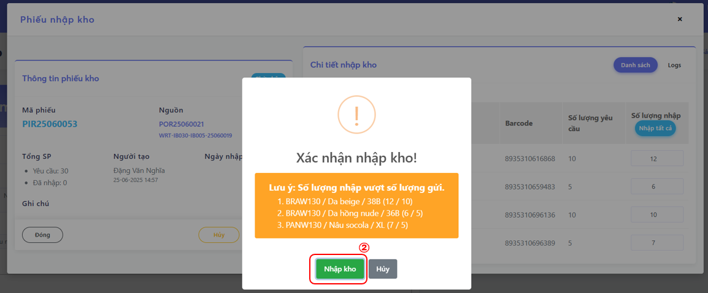

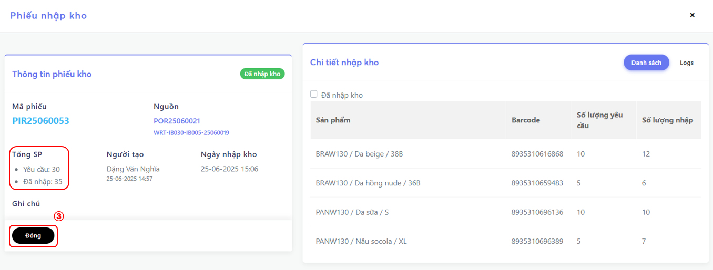

- Vào lại Module **Kho Hàng**
- Chọn **Sản Phẩm**
- Chọn **Chi Tiết** của **Xuất kho**

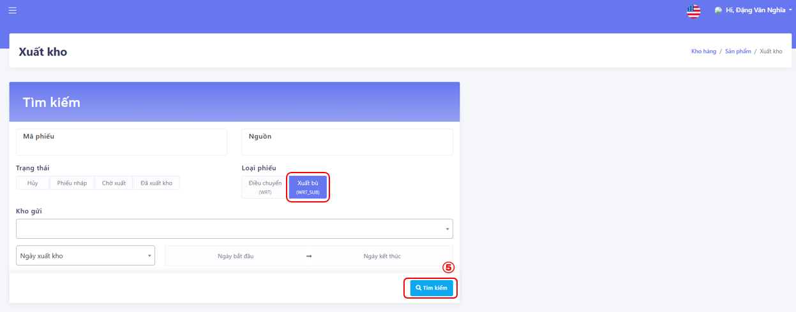

(*) Đơn hàng bù được hệ thống <strong>TỰ ĐỘNG TẠO</strong> sau khi<strong> Kho nhập</strong> nhập nhiều hơn so với yêu cầu

(*) <strong>WRT_SUB</strong> được ghi chú để xác định đơn gửi bù 

- Chọn **Xem chi tiết**

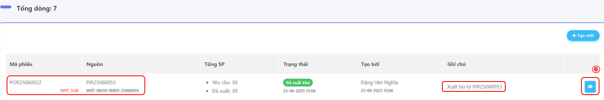

- Chọn **Đóng** sau khi kiểm tra thông tin

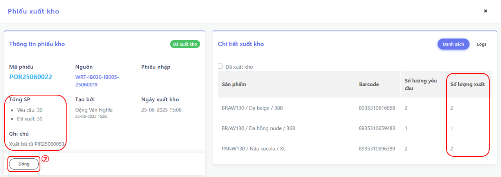

- Vào lại Module **Kho Hàng**
- Chọn **Sản Phẩm**
- Chọn **Chi Tiết** của **Phiếu điều chuyển**

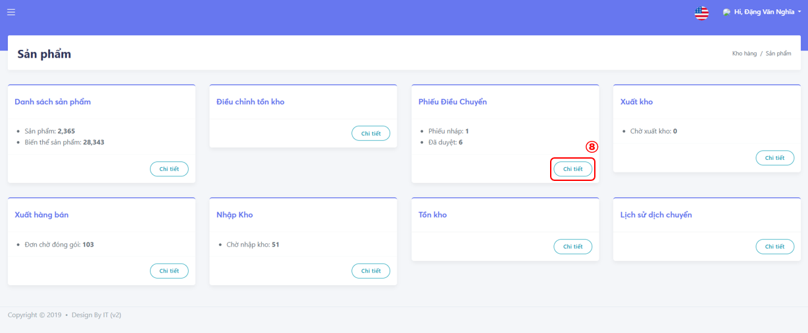

- Chọn **Xem chi tiết**

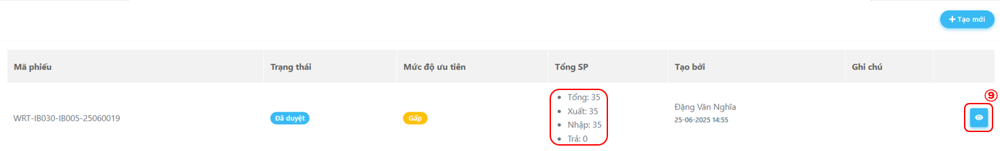

- Kiểm tra số lượng **xuất, nhận, nhận bù**
- Chọn **Hoàn thành** sau khi kiểm tra

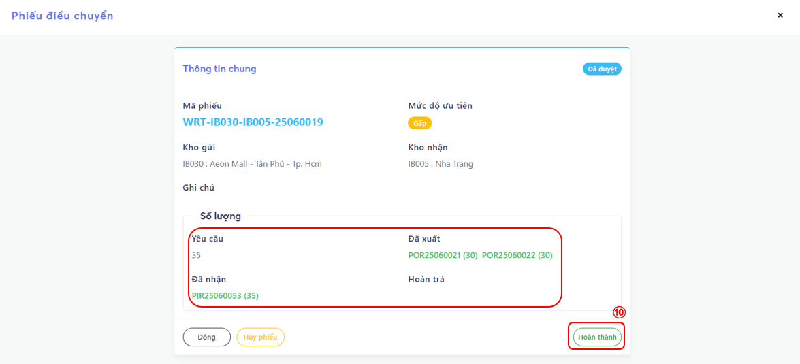

You can now deploy the `build` folder **almost anywhere** easily, **for free** or very small cost (read the **[Deployment Guide](https://docusaurus.io/docs/deployment)**).
