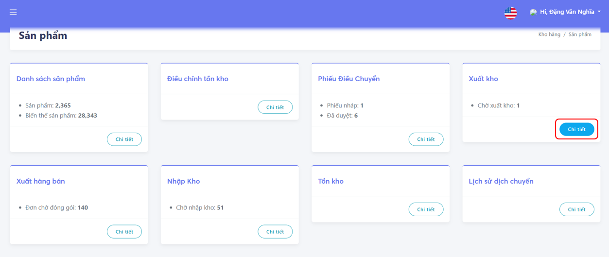
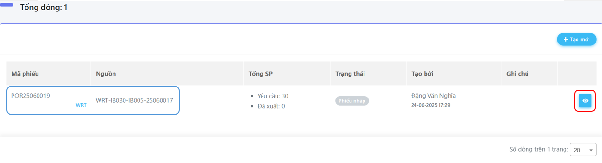
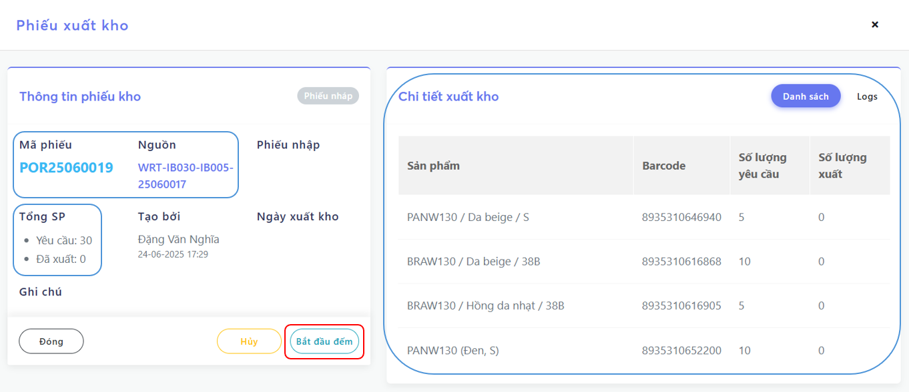
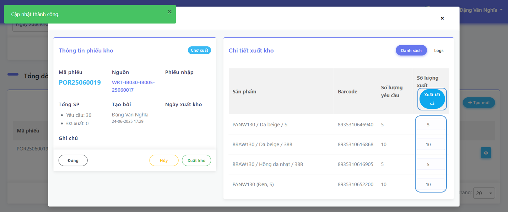

# Xuất kho

## 1. Quy trình **Xuất kho**

- Chọn **Kho hàng** → **Sản phẩm**

- Chọn **Trạng thái** và **Loại phiếu** trong ô tìm kiếm
- Chọn **Tìm Kiếm**

- Kiểm tra **Nguồn** và **Mã phiếu**
- Chọn **Xem chi tiết**

- Kiểm tra **Tổng sản phẩm** và **Chi tiết xuất kho**
- Chọn **Bắt đầu đếm**

- Chọn **Xuất tất cả** để xuất theo yêu cầu
- Kiểm tra lại và chọn **Xuất kho**

- Sau khi **Xuất kho** sẽ hiện **Phiếu nhập <em>(Chú ý để tiện theo dõi)</em>**
- Chọn **Đóng** khi hoàn tất

