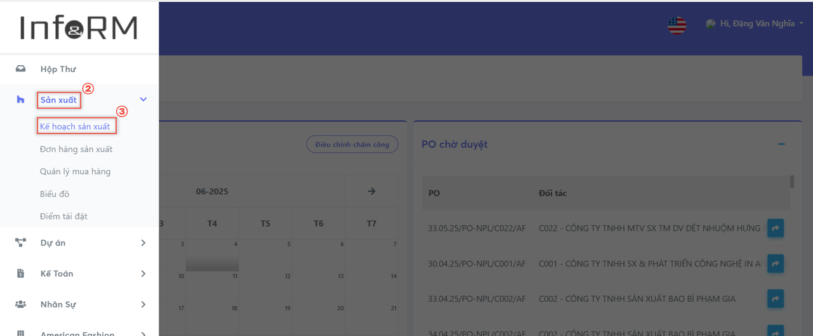
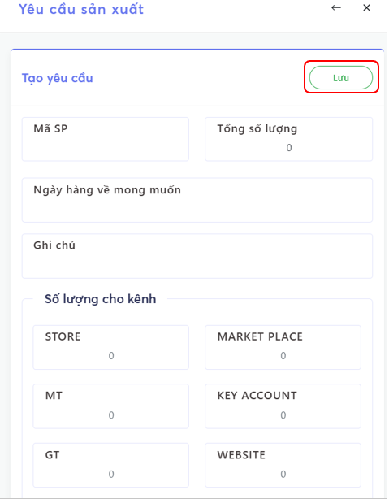
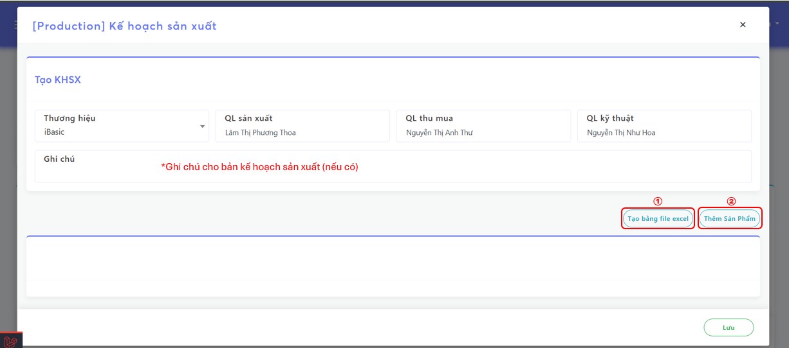
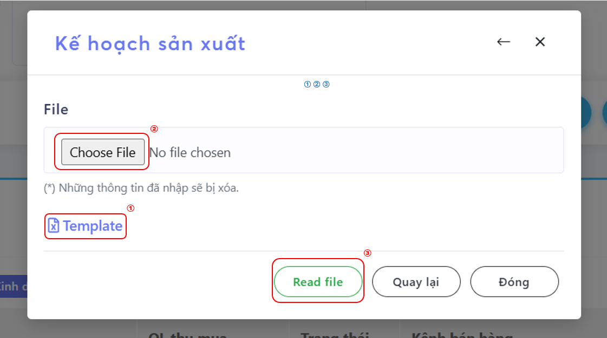
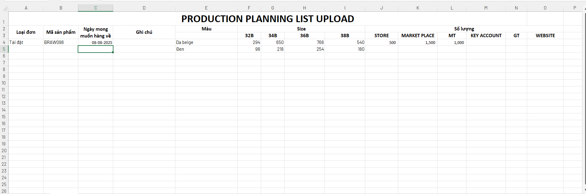
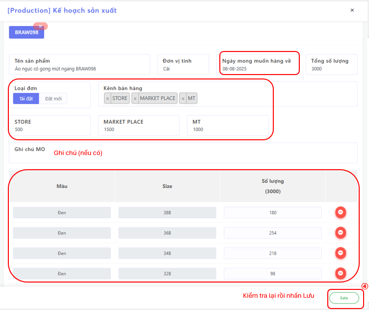
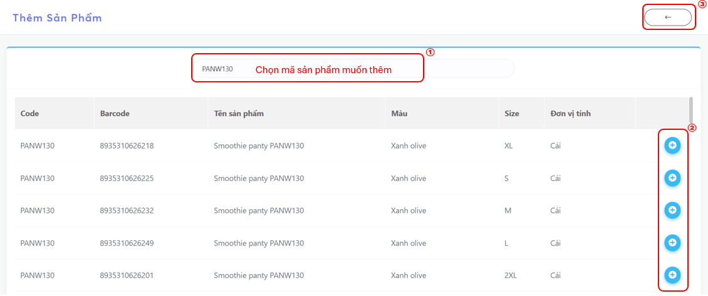
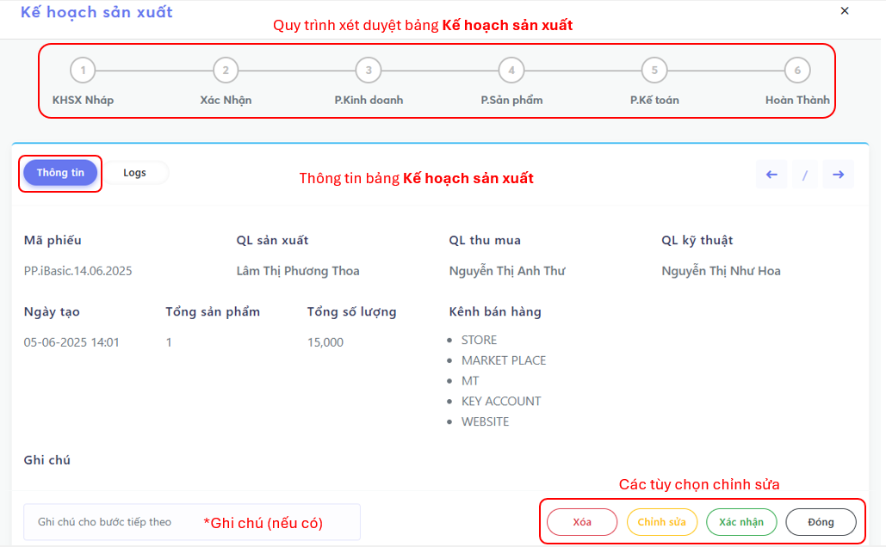
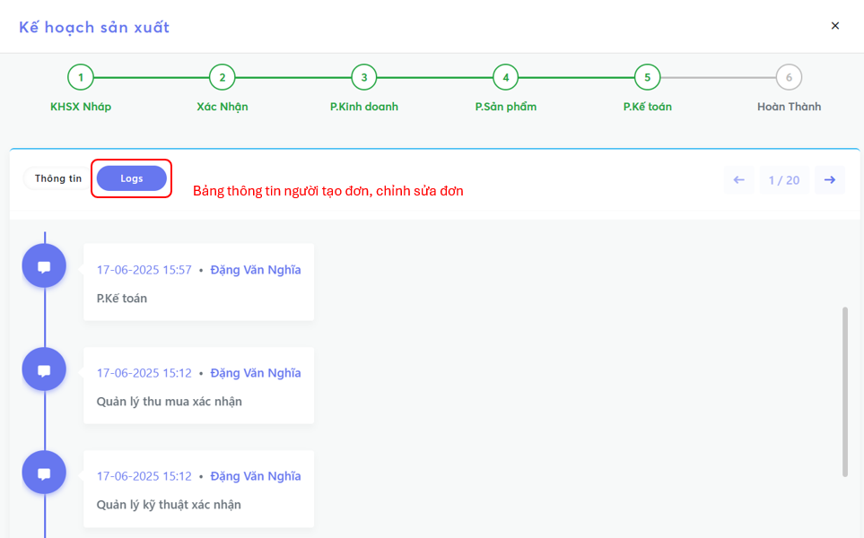

# Kế Hoạch Sản Xuất

## Các bước tạo **Kế Hoạch Sản Xuất**
- Chọn **Menu (☰)**

.png)

- Chọn **Module Sản Xuất**
- Chọn **Kế Hoạch Sản Xuất**

- Tạo **Kế Hoạch Sản Xuất** bao gồm 2 cách

  - 
<em>Cách 1: Chọn <strong>Yêu Cầu Sản Xuất</strong></em>

  - 
<em>Cách 2: Chọn <strong>Tạo Mới</strong></em>

### Cách 1: Chọn **Yêu Cầu Sản Xuất**

#### Tạo **Kế Hoạch Sản Xuất** từ **Yêu Cầu**

  - Chọn Yêu cầu cần tạo
  - Chọn **Hành động**
  - Chọn **Tạo KHSX**

.png)

#### Tạo **Kế Hoạch Sản Xuất** bằng cách **Tạo Yêu Cầu**

| Trường thông tin                     | Mô tả                                                         |
|--------------------------------------|---------------------------------------------------------------|
| Tên Sản Phẩm                         | Tên sản phẩm cần tìm                                          |
| Tổng số lượng                        | Tổng số lượng sản phẩm yêu cầu cho kênh                       |
| Ngày mong muốn hàng về               | Chọn ngày mong muốn hàng về                                   |
| Ghi chú                              | Ghi chú cho bản kế hoạch (Nếu có)                             |  
| Số lượng cho kênh                    | Điền số lượng sản phẩm yêu cầu cho mỗi kênh                   |

### Cách 2: Chọn **Tạo Mới**

- Thêm **Sản Phẩm** gồm 2 cách

  - 
<em>Cách 1: Chọn <strong>Tạo bằng file Excel</strong></em>

  - 
<em>Cách 2: Chọn <strong>Thêm Sản Phẩm</strong></em>

#### Cách 1: Chọn **Tạo bằng file Excel**

- Chọn **Template** để tải xuống 
- Điền thông tin vào File Excel
- Chọn **Choose File** để tải lên File Excel vừa điền
- Chọn **Read File**

<em>(*) Mẫu <strong>Template </strong>có sẵn</em>

- Nội dung tự động điền
- Chọn **Lưu** khi kiểm tra xong

#### Cách 2: Chọn **Thêm Sản Phẩm**

.png)

| Trường thông tin                     | Mô tả                                                        |
|--------------------------------------|---------------------------------------------------------------|
| Tên Sản Phẩm                         | Tên sản phẩm cần tìm                                          | 
| Đơn vị tính                          | Cái, bộ, pack, cặp...                                         |  
| Ngày mong muốn hàng về               | Chọn ngày mong muốn hàng về                                   |
| Tổng số lượng                        | Tổng số lượng sản phẩm yêu cầu cho kênh bán hàng              |
| Loại đơn                             | Tái đặt hoặc đặt mới sản phẩm                                 |  
| Kênh bán hàng                        | Chọn các kênh bán hàng cần yêu cầu                            |
| Marketplace, MT, Key Account         | Điền số lượng sản phẩm yêu cầu cho mỗi kênh bán hàng          |

<em>(*) Giao diện sau khi tạo bảng <strong>Kế hoạch sản xuất</strong></em>

