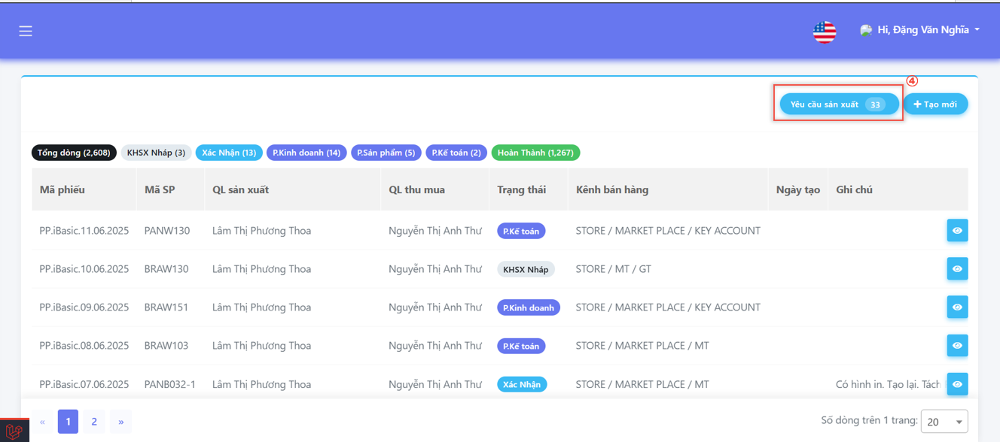
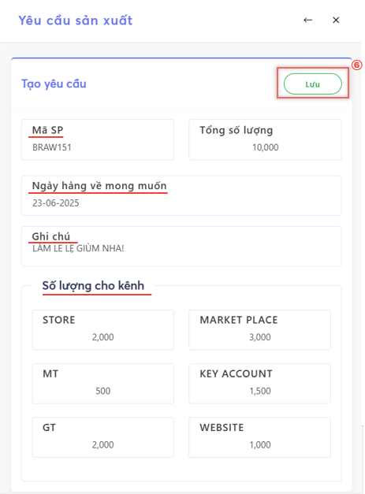
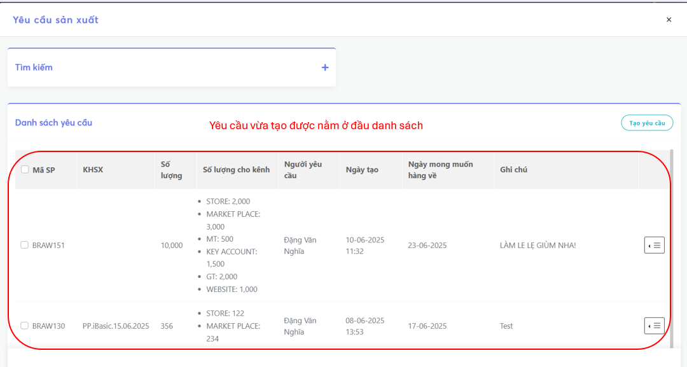

# Yêu Cầu Sản Xuất

## Các bước tạo **Yêu Cầu Sản Xuất**
- Chọn **Menu (☰)**

.png)

- Chọn **Module Sản Xuất**
- Chọn **Kế Hoạch Sản Xuất**

- Chọn **Yêu Cầu Sản Xuất**

- Chọn **Tạo Yêu Cầu**
- (*) Tìm yêu cầu có sẵn thông qua mã sản phẩm

.png)

- Chọn **Lưu** sau khi hoàn tất điền thông tin

| Trường thông tin                      | Mô tả                                                        |
|--------------------------------------|---------------------------------------------------------------|
| Mã SP                                | Mã sản phẩm cần tìm                                           |
| Ngày mong muốn hàng về               | Chọn ngày mong muốn hàng về                    	       |
| Ghi chú			       | Ghi chú cho bản yêu cầu (nếu có)               	       |
| Số lượng cho kênh		       | Số lượng sản phẩm yêu cầu cho mỗi kênh                        |

